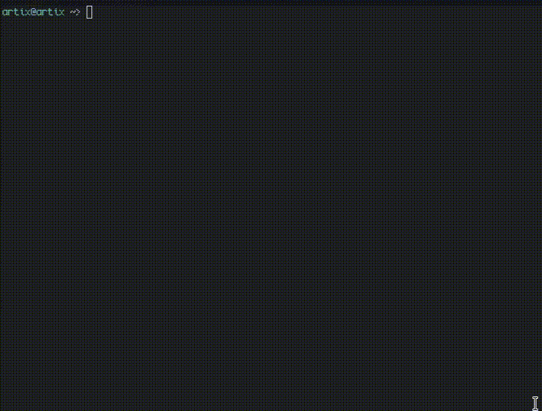

# takeit
takeit is a reddit script that downloads an arbitrary number of submissions from a subreddit into an arbitrary folder.

# usage
```
python takeit.py [sub] [amount of submissions] [folder to download them] [--nsfw]
```

# why should i use this over any other reddit downloader?

- nsfw filtering
- fast. (1.7s on modern wifi (354.9 MB), 10 submissions from [r/unixporn](https://reddit.com/r/unixporn))
- only ONE dependency!

# demo


# how to "self host"?

in a way, takeit is selhosted. how is it selfhosted? you need to create a app [here](https://www.reddit.com/prefs/apps). here are steps (after you've made an app in reddit):
1. in the directory that you've cloned `takeit`, add this to a `.env` file:
```env
# please don't copy paste this exactly, and then run it, and then get angry at me that it doesn't work.
REDDIT_SECRET="[YOUR REDDIT APP SECRET]"
REDDIT_ID="[YOUR REDDIT APP ID]"
```
2. install the dependencies for `takeit` via `pip install -r requirements.txt` or `py -m pip install -r requirements.txt` depending on your operating system.

# running

for example, let's say we want to download 10 submissions from [r/196](https://www.reddit.com/r/196), we would run something like this:
```
python takeit.py 196 10 test
```
this'll download 10 submissions (images, videos, and gifs) to the `test` directory.
